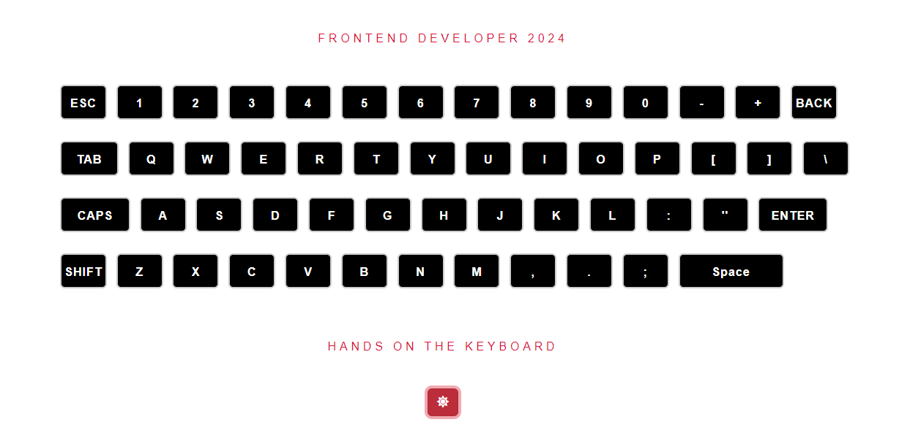

# virtual keyboard
A mini practice project simulating a virtual keyboard that displays animations for each key click and the corresponding values. The values are displayed on the board and receive their own animation.

# Dark Demo

  

# Light Demo

  

## Click on the link to run the project online 🧑‍💻
[Link to the Note application project View online](https://keyboarvirtual.netlify.app/)
